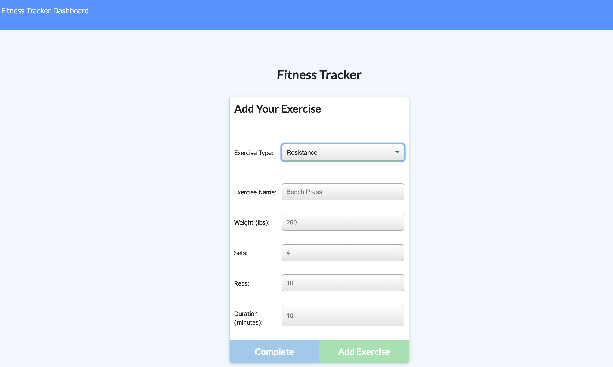

# fitness-tracker

## Description
With this workout tracker the user can create custom workout plans and log them! This application utilizes Node JS, Express, and Mongoose DB. This app has full Create, Read and Update functionality for all entered info.

## Link to Deployed App
* Click [here](https://young-garden-40678.herokuapp.com/) to use!

* Create an excersise routine by entering the name under 'Enter Workout' 
* In new box, create new exercises by enter the name, quantity, and unit for each exercise as well as an optional note. _Example:_
    * _Exercise Name:_  'Squat'
    * _Weight:_ 'lbs'
    * _Sets:_ '# of sets'
    * _Reps:_ '# of reps'
    * _Duration:_ 'mins'
* Update exercises by clicking in text field to edit and clicking the 'Update!' button
* Repeat
* See gains!

## Built With

* [JQuery](https://jquery.com/)
* [Node JS](https://nodejs.org/en/)
* [Mongoose](https://mongoosejs.com/)

## Authors

* **Patrick Stutts** - *Initial work* - [patrickstutts](https://github.com/patrickstutts)
* [patrickstutts@gmail.com](mailto:patrickstutts@gmail.com)
